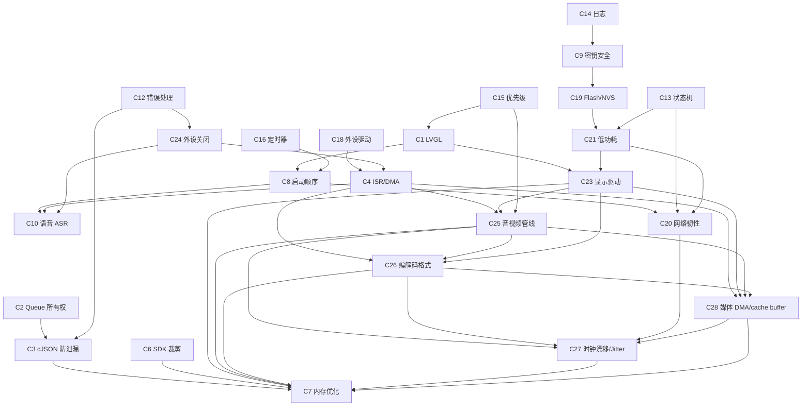

# 约束知识图谱（L2+ 按需加载）

Agent 做 code review 或修改代码时，可读取本文件获取约束间的**依赖、冲突、联动**关系，自动推理影响范围。

> 27 个约束域、153 条规则之间的关系网络。修改一条约束时，参考本图评估连锁影响。

---

## 依赖关系（A → B：满足 A 是满足 B 的前提）



| 依赖关系 | 说明 |
|----------|------|
| C2 → C3 | Queue payload 先解决所有权（C2），cJSON 泄漏审查才有意义（C3） |
| C3+C2 → C7 | 先修泄漏，再谈内存优化（C7.2 顺序） |
| C6 → C7 | 先裁未用模块，再缩池/缩栈 |
| C8 → C10 | 启动顺序正确（C8.1），语音会话才能正常初始化（C10） |
| C4 → C10 | ISR/DMA 安全（C4），I2S 采集才有有效数据（C10） |
| C24 → C10 | 音频/媒体 stop 与 deinit 边界正确（C24），半双工 MIC/SPK 共享引擎才不会在打断后误释放 capture backend（C10） |
| C1+C15 → C8 | LVGL 线程安全（C1）+ 优先级正确（C15）是启动顺序（C8）的基础 |
| C18 → C4 | 外设驱动正确初始化（C18），ISR/DMA 才能正常工作（C4） |
| C13 → C20 | 状态机（C13）是网络韧性（C20）断线重连/降级的基础 |
| C14 → C9 | 日志脱敏（C14.4）是密钥安全（C9.3）的日志端落实 |
| C19 → C21 | NVS 状态持久化（C19）是低功耗睡眠/唤醒（C21）的数据基础 |
| C21 → C20 | 低功耗唤醒后重连（C21.2）依赖网络韧性（C20）的退避/降级策略 |
| C13 → C21 | 状态机（C13）管理睡眠/唤醒/活跃状态转换（C21） |
| C1 → C23 | LVGL 线程安全（C1）是显示驱动（C23）flush 回调的基础 |
| C23 → C7 | 帧缓冲管理（C23.5）直接影响内存优化（C7）策略 |
| C21 → C23 | 低功耗管理（C21.4）关闭 LCD 背光电源依赖显示驱动（C23.2） |
| C4+C23+C15 → C25 | 音视频同步依赖 DMA 安全、显示刷新策略与优先级分配 |
| C25 → C7 | 音视频帧池/ring buffer 与丢帧策略直接影响内存优化 |
| C4+C25+C23 → C26 | 编解码格式依赖 DMA PCM 数据、A/V 帧元数据和显示像素格式 |
| C26 → C7 | 编解码 workspace、packet pool、stride padding 直接影响内存优化 |
| C25+C26+C20 → C27 | 长时间 A/V 同步依赖管线 PTS、媒体格式和网络抖动恢复策略 |
| C27 → C7 | jitter buffer 深度、补静音和 resync 状态直接影响 RAM、telemetry 与固定块策略 |
| C4+C23+C25+C26 → C28 | 媒体 DMA/cache buffer 依赖 DMA 安全、显示 flush、帧池队列和媒体格式大小 |
| C28 → C7 | DMA-capable pool、cache line 对齐和零拷贝 frame pool 直接影响 C7.8/C7.10/C7.13 的 RAM/PSRAM 分配策略 |
| C28 → C27 | stale frame、坏 PCM 和 reuse-before-release 会表现成长时间 drift、jitter 或 underrun |

---

## 冲突关系（A ↔ B：同时满足需要权衡）

| 约束 A | 约束 B | 冲突场景 | 权衡方案 |
|--------|--------|----------|----------|
| **C8.6** init 禁同步 TLS | **C8.2** TLS 前须 SNTP | app_main 中需要时间同步 | 异步 SNTP + 回调通知 |
| **C1.6** 先网络后 LVGL 锁 | **ESP32 SDK** esp_lvgl_port 锁序 | SDK 内部锁序可能相反 | 以 SDK 为准；用 lv_async_call 规避 |
| **C7.5** WSS 栈 ≥4096 | **RAM < 200KB** | 内存极度受限 | 先裁 SDK（C6），不缩 WSS 栈 |
| **C4.5** 音频优先级 > LVGL | **C15.1** 相邻差 ≥2 | 优先级分配 | 音频=MAX-1, WSS=MAX-3, LVGL=MAX-5 |
| **C14.1** 需要日志排查 | **C4.3/C14.3** ISR 禁日志 | 调试需求 vs 安全 | ISR 中用 flag，任务中打印 |
| **C5.1** APP_TEST_MODE_* | **C6** 量产关闭 | 测试宏 vs 代码体积 | 默认 #define 0，编译器优化掉 |
| **C9.1** 密钥不入库 | **调试便利** | 开发阶段频繁烧写 | config.secrets.example + .gitignore |
| **C17.1** 跨核须 IPC | **延迟需求** | IPC 增加延迟 | 高频用硬件信号量（C17.3），低频用 mailbox |
| **C11.5** 函数 ≤80 行 | **C12.4** goto cleanup | cleanup 模板增加行数 | cleanup 代码不计入业务行数 |
| **C16.1** timer 回调禁阻塞 | **业务逻辑** | timer 中需发事件 | 回调仅 xQueueSend，逻辑移到专用任务 |
| **C21.4** 睡眠前关 WiFi | **C20.5** 网络须降级 | 深睡眠断网 | 主动断 WSS + 通知云端，唤醒后走完整重连（C20.1） |
| **C21.3** Tickless Idle | **C4.5** 音频优先级最高 | tickless 导致音频卡顿 | 语音活跃期禁 tickless，空闲时启用 |
| **C23.5** 帧缓冲需 RAM | **C7** 内存优化 | 全屏双缓冲占 300KB+ | PSRAM 可用→全屏双缓冲；RAM 不足→部分刷新（1/10 屏） |
| **C23.3** 帧率匹配 | **C4.5** 音频优先级高 | 音频任务可能抢占 LVGL | 音频优先级 MAX-1，LVGL MAX-5（满足 C15.1 差≥2） |
| **C25.1** audio clock master | **C23.3** 显示帧率匹配 | 显示平滑 vs lip-sync | 音频为主，视频按 PTS 丢帧/重复帧 |
| **C25.3** 有界 video queue | **C7.13** 固定块池 | 视频不丢帧 vs RAM 上限 | 预分配短 ring，满时 drop-oldest，禁止扩容阻塞 |
| **C26.1** 格式一致或显式转换 | **C25.4** 热路径禁分配 | 转换器需要 workspace | start 阶段预分配转换器 workspace，运行期只处理固定块 |
| **C26.5** codec 生命周期 | **C4.5** 音频优先级最高 | 编码质量 vs 延迟 | 启动时协商参数，运行期禁止重建 codec |
| **C27.2** jitter buffer 水位 | **C25.3** 队列有界低阻塞 | 抗抖动 vs 低延迟 | 固定 target delay + high watermark，满水位 drop/insert，不扩容阻塞 |
| **C27.3** drift correction 限幅 | **C26.5** codec 生命周期 | 漂移校正 vs 编码稳定 | 小漂移 bounded resample，大漂移 resync，禁止每帧 reset codec |
| **C28.3** 零拷贝 owner/generation | **C25.3** 有界队列 | 省拷贝 vs 生命周期复杂度 | 只传 index/handle，consumer release 后复用，满队列 drop-oldest |
| **C28.1** DMA-capable 内存 | **C7.10** 外部 RAM 优先 | PSRAM 容量 vs DMA 可访问性 | DMA 热路径用 internal/DMA SRAM；外部 RAM 仅放普通/低频/非 DMA 对象或显式同步 copy |
| **C28.2/C28.5** cache 同步 | **C4.5** 音频高优先级 | cache 操作开销 vs 实时性 | 按 frame/half-buffer 批量 clean/invalidate，范围对齐且最小化 |

---

## 联动关系（改 A 时必须同步检查 B）

| 变更 | 联动检查 | 说明 |
|------|----------|------|
| 改 C1（LVGL 线程安全） | C15（优先级）、C8（启动） | LVGL 任务优先级和创建顺序 |
| 改 C2（Queue 所有权） | C3（cJSON）、C12（错误处理） | payload 释放路径 |
| 改 C4（ISR/DMA） | C18（外设驱动）、C10（语音） | 外设初始化 + 音频链路 |
| 改 C7（内存优化） | C6（SDK 裁剪）、C12（错误处理）、C14（日志）、C19（Flash/NVS）、C28（DMA/cache buffer） | allocator failure 路径、heap telemetry、外部 RAM 优先和 DMA/实时路径须联动 |
| 改 C8（启动顺序） | C20（网络韧性）、C10（语音） | 网络和语音初始化时序 |
| 改 C9（密钥安全） | C14（日志）、C19（Flash/NVS） | 日志脱敏 + NVS 存储 |
| 改 C10（语音 ASR） | C4（ISR）、C8（启动）、C13（状态机） | 音频 ISR + 启动顺序 + 会话状态 |
| 改 C24（外设关闭） | C4（DMA/ISR）、C10（语音）、C21（低功耗） | DMA idle、shared audio backend、低功耗 deinit 边界 |
| 改 C13（状态机） | C20（网络韧性）、C16（定时器） | 网络状态机 + 超时定时器 |
| 改 C17（多核 IPC） | C1（LVGL）、C4（ISR） | 跨核 UI 更新 + 跨核 DMA |
| 改 C18（外设驱动） | C4（ISR/DMA）、hw_sw_cocodebug | 外设初始化 + IO 口核对 |
| 改 C21（低功耗） | C19（Flash/NVS）、C20（网络韧性）、C13（状态机） | 状态持久化 + 唤醒重连 + 睡眠状态转换 |
| 改 C23（显示驱动） | C1（LVGL）、C7（内存）、C21（低功耗） | LVGL flush 回调 + 帧缓冲分配 + 背光电源 |
| 改 C25（音视频管线） | C4（DMA/ISR）、C23（显示）、C15（优先级）、C7（内存） | A/V sync、帧池、丢帧和热路径实时性 |
| 改 C26（编解码格式） | C4（DMA/ISR）、C25（音视频管线）、C23（显示）、C7（内存） | sample rate、frame size、pixel format、codec workspace |
| 改 C27（时钟漂移/Jitter） | C25（音视频管线）、C26（编解码格式）、C20（网络韧性）、C7（内存） | master clock、PTS、jitter buffer 水位、drift ppm、underrun/overrun |
| 改 C28（媒体 DMA/cache buffer） | C4（DMA/ISR）、C7（内存）、C23（显示）、C25（音视频管线）、C26（媒体格式） | DMA-capable 区域、cache 同步、frame pool owner、stride/half-buffer 大小 |

---

## 影响分析模板

Agent 修改代码时，若涉及约束变更，按以下模板输出影响分析：

```markdown
## 约束影响分析

### 变更约束
- C#.# — 变更内容

### 直接依赖
- [ ] C#.# — 需检查：____

### 联动约束
- [ ] C#.# — 需同步更新：____

### 冲突风险
- [ ] C#.# ↔ C#.# — 权衡方案：____
```

---

## 约束域统计

| 维度 | 数量 |
|------|------|
| 约束域 | 27 |
| 总规则数 | 153 |
| P0（必崩） | 57 |
| P1（量产问题） | 69 |
| P2（可维护性） | 27 |
| 自动化 Checker | 23 |
| 场景 Prompt | 32 |
| 产品线 Profile | 4 |

---

## 后续约束域候选（待评估）

| 候选域 | 说明 | 来源 |
|--------|------|------|
| C22 OTA 安全 | 签名验证/回滚策略/分区校验/断点续传 | ESP32 OTA + STM32 IAP |
| C29 传感器集成 | I2C/SPI 传感器初始化/校准/数据融合 | 常见传感器 datasheet |
